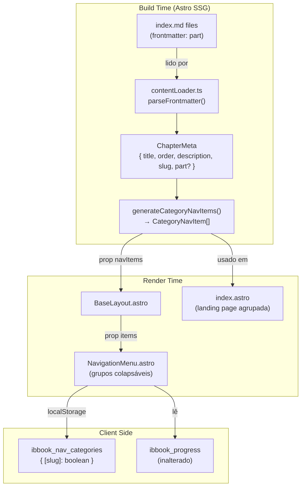

# Design Técnico — chapter-categories

## Visão Geral

Esta feature agrupa os 47 capítulos do livro por categoria (campo `part` do frontmatter) na navegação lateral e na página inicial. O campo `part` já existe nos arquivos `index.md` de cada capítulo, mas não é lido nem utilizado. A implementação consiste em:

1. Estender `contentLoader.ts` para ler `part` e gerar uma estrutura `CategoryNavItem[]`.
2. Atualizar `NavigationMenu.astro` para renderizar grupos colapsáveis com acessibilidade.
3. Atualizar `index.astro` para exibir os capítulos agrupados por categoria.
4. Manter compatibilidade retroativa com o sistema de progresso e URLs existentes.

Nenhuma dependência nova é necessária — o projeto já usa `fast-check` para testes de propriedade e `@testing-library/preact` + `happy-dom` para testes de componente.

---

## Arquitetura



### Decisões de design

- `CategoryNavItem` estende `NavItem` adicionando apenas a semântica de "grupo". Isso mantém compatibilidade retroativa: `NavigationMenu` aceita `NavItem[]` ou `CategoryNavItem[]` — a distinção é feita pela presença de `children` com itens que têm `children` próprios (seções).
- O colapso é implementado com CSS (`display: none` / `display: block`) controlado por atributo `data-collapsed` no elemento `<li>` da categoria, manipulado por script inline no componente. Isso evita dependência de Preact para um comportamento simples.
- O estado de colapso é persistido em `localStorage` sob a chave `ibbook_nav_categories` como um objeto `{ [categorySlug]: boolean }` onde `true` = colapsado.
- A categoria do capítulo ativo é sempre expandida na inicialização, sobrepondo o estado persistido.

---

## Componentes e Interfaces

### `contentLoader.ts` — extensões

```typescript
// Campo adicionado a ChapterMeta
export interface ChapterMeta {
  title: string;
  order: number;
  description: string;
  slug: string;
  part?: string;          // novo — valor exato do frontmatter, sem transformação
}

// Novo tipo — representa um grupo de categoria na navegação
export interface CategoryNavItem {
  title: string;          // Category_Label (ex: "Parte 2 — Cadastro e Onboarding (KYC)")
  slug: string;           // kebab-case derivado do título (ex: "parte-2-cadastro-e-onboarding-kyc")
  url: string;            // sempre "#" (não é uma página navegável)
  children: NavItem[];    // capítulos do grupo, ordenados por `order` crescente
}

// Nova função exportada
export function generateCategoryNavItems(
  chapters: Array<{ slug: string; meta: ChapterMeta; sections: Array<{ slug: string; frontmatter: SectionFrontmatter }> }>
): CategoryNavItem[];

// Utilitário interno
function toCategorySlug(part: string): string; // kebab-case do título da categoria
```

**Algoritmo de `generateCategoryNavItems`:**

1. Iterar sobre os capítulos ordenados por `order` crescente.
2. Agrupar por `part` mantendo a ordem de primeira aparição (Map preserva inserção).
3. Capítulos sem `part` vão para um grupo com `title: ''` e `slug: 'sem-categoria'`, inserido ao final.
4. Para cada grupo, gerar o `CategoryNavItem` com `children` ordenados por `order`.

### `parseFrontmatter` — extensão

Adicionar leitura do campo `part` ao parser existente. O campo é opcional; se ausente, retorna `undefined`. O valor é preservado sem transformação.

### `NavigationMenu.astro` — extensão

**Props (sem breaking change):**

```typescript
interface Props {
  items: NavItem[];   // aceita NavItem[] ou CategoryNavItem[] (CategoryNavItem extends NavItem)
  currentUrl: string;
}
```

**Lógica de renderização:**

- Se um item tem `children` e pelo menos um filho tem `children` próprios (seções), é tratado como `CategoryNavItem` → renderiza grupo colapsável.
- Caso contrário, renderiza como hoje (capítulo com seções aninhadas).

**Estrutura HTML de um grupo:**

```html
<li class="nav-category" data-category-slug="parte-2-...">
  <button
    class="nav-category-btn"
    aria-expanded="true"
    aria-controls="nav-cat-parte-2-..."
    aria-label="Parte 2 — Cadastro e Onboarding (KYC)"
  >
    <span class="nav-category-label">Parte 2 — Cadastro e Onboarding (KYC)</span>
    <span class="nav-category-chevron" aria-hidden="true">▾</span>
  </button>
  <ul id="nav-cat-parte-2-..." class="nav-chapter-list" role="list">
    <!-- capítulos do grupo (estrutura existente de nav-chapter) -->
  </ul>
</li>
```

**Script client-side (inline no componente):**

- Na inicialização: ler `ibbook_nav_categories` do localStorage; expandir a categoria do capítulo ativo; aplicar estados.
- No clique do botão: alternar `aria-expanded`, toggle de classe `nav-category--collapsed` no `<li>`, persistir no localStorage.
- `updateVisitedIndicators()` permanece inalterada.

### `index.astro` — extensão

- Substituir o `<ol class="chapters-list">` flat por uma estrutura agrupada usando `generateCategoryNavItems`.
- Renderizar um `<h3 class="category-label">` antes de cada grupo de capítulos.
- Capítulos sem categoria são renderizados ao final sem rótulo de grupo.

---

## Modelos de Dados

### `ChapterMeta` (atualizado)

| Campo | Tipo | Obrigatório | Descrição |
|---|---|---|---|
| `title` | `string` | sim | Título do capítulo |
| `order` | `number` | sim | Ordem de exibição |
| `description` | `string` | sim | Descrição curta |
| `slug` | `string` | sim | Slug da pasta |
| `part` | `string \| undefined` | não | Valor exato do campo `part` do frontmatter |

### `CategoryNavItem`

| Campo | Tipo | Descrição |
|---|---|---|
| `title` | `string` | Category_Label (ex: `"Parte 1 — Fundamentos do Banco"`) |
| `slug` | `string` | kebab-case do título (ex: `"parte-1-fundamentos-do-banco"`) |
| `url` | `string` | `"#"` — não é uma rota navegável |
| `children` | `NavItem[]` | Capítulos do grupo, ordenados por `order` crescente |

### Estado de colapso no localStorage

```json
// chave: "ibbook_nav_categories"
{
  "parte-1-fundamentos-do-banco": false,
  "parte-2-cadastro-e-onboarding-kyc": true
}
```

`true` = colapsado, `false` = expandido. Ausência da chave = expandido (padrão).

---

## Propriedades de Correção

*Uma propriedade é uma característica ou comportamento que deve ser verdadeiro em todas as execuções válidas do sistema — essencialmente, uma afirmação formal sobre o que o sistema deve fazer. Propriedades servem como ponte entre especificações legíveis por humanos e garantias de correção verificáveis por máquina.*

### Propriedade 1: Round-trip do campo `part`

*Para qualquer* string não-vazia `s`, se um frontmatter contém `part: s`, então `parseFrontmatter` deve retornar um objeto com `part === s` (valor exato, sem transformação).

**Valida: Requisitos 1.1, 1.4**

---

### Propriedade 2: Invariante de agrupamento e forma do CategoryNavItem

*Para qualquer* lista de capítulos, `generateCategoryNavItems` deve retornar exatamente um `CategoryNavItem` por valor distinto de `part`, e cada `CategoryNavItem` deve conter os campos `title`, `slug`, `url` e `children`.

**Valida: Requisitos 2.1, 2.2, 2.6**

---

### Propriedade 3: Ordenação dos grupos por ordem do primeiro capítulo

*Para qualquer* lista de capítulos, a lista de `CategoryNavItem` retornada deve estar ordenada pelo valor mínimo de `order` entre os capítulos de cada grupo.

**Valida: Requisito 2.3**

---

### Propriedade 4: Ordenação dos capítulos dentro de cada grupo

*Para qualquer* `CategoryNavItem` retornado por `generateCategoryNavItems`, os `children` devem estar ordenados por `order` crescente.

**Valida: Requisito 2.4**

---

### Propriedade 5: Compatibilidade retroativa com `NavItem[]` simples

*Para qualquer* lista de `NavItem[]` sem `CategoryNavItem` (estrutura atual), o `NavigationMenu` deve renderizar os itens sem erros e sem alterar o comportamento existente.

**Valida: Requisito 3.5**

---

### Propriedade 6: Toggle de colapso é idempotente em dois cliques

*Para qualquer* categoria, clicar no controle de colapso duas vezes deve restaurar o estado original de `aria-expanded`.

**Valida: Requisito 4.2**

---

### Propriedade 7: Categoria do capítulo ativo é auto-expandida

*Para qualquer* `currentUrl` que corresponda a uma seção dentro de uma categoria, essa categoria deve ter `aria-expanded="true"` na inicialização, independentemente do estado persistido no localStorage.

**Valida: Requisito 4.5**

---

### Propriedade 8: Category_Label da categoria ativa recebe destaque

*Para qualquer* `currentUrl` que pertença a uma categoria, o botão dessa categoria deve ter a classe de destaque ativo aplicada; para `currentUrl` que não pertença a nenhuma categoria, nenhum botão deve ter essa classe.

**Valida: Requisitos 5.1, 5.3**

---

### Propriedade 9: Indicadores de seção visitada preservados dentro de categorias

*Para qualquer* estrutura de navegação com `CategoryNavItem`, os elementos `[data-visited-slug]` devem estar presentes nos itens de seção dentro dos grupos, garantindo que `updateVisitedIndicators` continue funcionando.

**Valida: Requisitos 8.1, 8.3**

---

### Propriedade 10: URLs de capítulos e seções não são alteradas

*Para qualquer* capítulo e seção, a URL gerada por `generateSectionUrl` deve ser idêntica antes e depois da introdução de categorias.

**Valida: Requisito 8.4**

---

## Tratamento de Erros

| Situação | Comportamento |
|---|---|
| `part` ausente no frontmatter | `ChapterMeta.part = undefined`; capítulo vai para grupo sem rótulo ao final |
| `part` com valor vazio `""` | Tratado como ausente — capítulo vai para grupo sem rótulo |
| `localStorage` indisponível (modo privado) | `try/catch` silencioso; estado de colapso mantido apenas em memória |
| `localStorage` com JSON corrompido | `try/catch` silencioso; estado padrão (todos expandidos) |
| Lista de capítulos vazia | `generateCategoryNavItems([])` retorna `[]` sem erro |
| Categoria com um único capítulo | Renderizada normalmente — sem tratamento especial |

---

## Estratégia de Testes

### Testes unitários (`src/tests/chapterCategories.test.ts`)

Cobrem exemplos específicos e casos de borda:

- `parseFrontmatter` lê `part` corretamente de um frontmatter real
- `parseFrontmatter` retorna `part: undefined` quando campo ausente
- `generateCategoryNavItems` com lista vazia retorna `[]`
- `generateCategoryNavItems` com capítulos sem `part` cria grupo ao final com `title: ''`
- `generateCategoryNavItems` com todos os capítulos na mesma `part` retorna um único grupo
- `toCategorySlug` converte corretamente strings com acentos e parênteses
- Verificação estrutural: `NavigationMenu.astro` contém `aria-expanded` e `aria-controls`
- Verificação estrutural: `NavigationMenu.astro` contém `ibbook_nav_categories`
- Verificação estrutural: `updateVisitedIndicators` permanece no source
- Verificação: chave `ibbook_progress` não foi alterada no source

### Testes de propriedade (`src/tests/chapterCategories.test.ts`)

Usam `fast-check` com mínimo de 100 iterações cada. Cada teste referencia a propriedade do design:

```
// Feature: chapter-categories, Property 1: round-trip do campo part
// Feature: chapter-categories, Property 2: invariante de agrupamento e forma
// Feature: chapter-categories, Property 3: ordenação dos grupos
// Feature: chapter-categories, Property 4: ordenação dentro dos grupos
// Feature: chapter-categories, Property 5: compatibilidade retroativa NavItem[]
// Feature: chapter-categories, Property 6: toggle idempotente
// Feature: chapter-categories, Property 7: categoria ativa auto-expandida
// Feature: chapter-categories, Property 8: destaque da categoria ativa
// Feature: chapter-categories, Property 9: indicadores visitados preservados
// Feature: chapter-categories, Property 10: URLs inalteradas
```

**Geradores fast-check relevantes:**

```typescript
// Capítulo com part aleatório
const arbChapter = fc.record({
  slug: fc.stringMatching(/^[a-z0-9-]+$/),
  meta: fc.record({
    title: fc.string({ minLength: 1 }),
    order: fc.nat(),
    description: fc.string(),
    slug: fc.stringMatching(/^[a-z0-9-]+$/),
    part: fc.option(fc.string({ minLength: 1 }), { nil: undefined }),
  }),
  sections: fc.array(fc.record({
    slug: fc.stringMatching(/^[a-z0-9-]+$/),
    frontmatter: fc.record({
      title: fc.string({ minLength: 1 }),
      order: fc.nat(),
    }),
  })),
});
```

### Testes de preservação

Os testes existentes em `preservation.test.ts` continuam passando sem modificação — a compatibilidade retroativa (Propriedade 5) garante isso. Nenhum teste de preservação existente precisa ser alterado.
