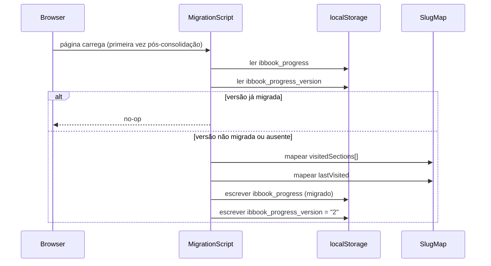

# Design Document — Chapter Consolidation

## Overview

Esta feature reorganiza os 78 capítulos atuais (`00`–`77`) em 29 capítulos numerados `01`–`29`, agrupados em 12 Partes temáticas. O objetivo é reduzir a fragmentação do conteúdo, tornar a navegação mais coerente e introduzir o conceito de Partes na interface.

A consolidação envolve cinco frentes técnicas:

1. **Migração de conteúdo** — renomear/mover pastas e arquivos MDX
2. **Schema de metadados** — adicionar `part` e `partOrder` ao `index.md`
3. **Slug_Map** — mapeamento completo de slugs antigos para novos
4. **Migration Script** — migração do `localStorage` para os novos slugs
5. **Atualização de código** — `contentLoader`, navegação e testes

Nenhum conteúdo textual é perdido. O capítulo 13 (Títulos de Capitalização) é criado como conteúdo novo.

---

## Architecture

```mermaid
flowchart TD
    subgraph "Fase 1 — Migração de Conteúdo (manual/script)"
        A[78 pastas originais\n00–77] -->|rename + merge| B[29 pastas consolidadas\n01–29]
        B --> C[Renumeração de seções\nNN- prefix + order]
        C --> D[Atualização de\nreferências cruzadas]
    end

    subgraph "Fase 2 — Artefatos de Código"
        E[chapterSlugMap.ts\nSlug_Map completo] --> F[progressMigration.ts\nMigration Script]
        E --> G[content-structure.test.ts\nTestes atualizados]
    end

    subgraph "Fase 3 — Atualização do Runtime"
        H[contentLoader.ts\n+ partOrder em ChapterMeta] --> I[[...slug].astro\nnavegação por Partes]
    end

    B --> E
    F -->|lê/escreve| J[(localStorage\nibbook_progress)]
    H --> I
```

### Fluxo de dados em runtime



---

## Components and Interfaces

### 1. `src/utils/chapterSlugMap.ts`

Exporta a constante `CHAPTER_SLUG_MAP` e a versão de migração.

```typescript
export const MIGRATION_VERSION = "2";

// Record<oldSlug, newSlug>
// oldSlug: "<old-chapter-slug>/<section-file-slug>"
// newSlug: "<new-chapter-slug>/<section-file-slug>"
export const CHAPTER_SLUG_MAP: Record<string, string> = {
  // Parte I — Fundamentos
  "00-introducao/01-objetivo": "01-fundamentos-bancarios/01-objetivo",
  "00-introducao/02-o-que-e-backoffice": "01-fundamentos-bancarios/02-o-que-e-backoffice",
  "01-o-que-e-um-banco/01-conceitos": "01-fundamentos-bancarios/03-conceitos",
  // ... (entrada completa no script de migração)
};
```

### 2. `src/utils/progressMigration.ts`

```typescript
import { CHAPTER_SLUG_MAP, MIGRATION_VERSION } from './chapterSlugMap';

interface ProgressStore {
  visitedSections: string[];
  lastVisited: string | null;
}

export function migrateProgress(): void { /* ... */ }
export function readProgressStore(): ProgressStore | null { /* ... */ }
export function writeProgressStore(store: ProgressStore): void { /* ... */ }
```

### 3. `contentLoader.ts` — ChapterMeta atualizado

```typescript
export interface ChapterMeta {
  title: string;
  order: number;
  description: string;
  slug: string;
  part?: string;
  partOrder?: number;  // NOVO — Req 10.5
}
```

A função `generateCategoryNavItems` passa a usar `partOrder` para ordenar os grupos em vez do `minOrder` dos capítulos.

### 4. `content/chapters/NN-slug/index.md` — Schema atualizado

```yaml
---
title: "Capítulo N — Título"
order: N                          # inteiro 1–29
description: "Descrição do capítulo"
part: "Parte N — Título da Parte" # string exata, consistente entre capítulos da mesma Parte
partOrder: N                      # inteiro 1–12
---
```

---

## Data Models

### Mapeamento de consolidação (78 → 29 capítulos)

| Novo Cap. | Novo Slug | Parte | partOrder | Capítulos de Origem |
|-----------|-----------|-------|-----------|---------------------|
| 01 | `01-fundamentos-bancarios` | Parte I — Fundamentos do Banco Comercial | 1 | 00, 01 |
| 02 | `02-regulacao-e-arquitetura` | Parte I — Fundamentos do Banco Comercial | 1 | 02, 03 |
| 03 | `03-kyc-onboarding-ledger` | Parte I — Fundamentos do Banco Comercial | 1 | 04, 05, 06, 10, 11, 12 |
| 04 | `04-contas-bancarias` | Parte II — Conta Corrente, Poupança e Tarifas | 2 | 07, 08, 09 |
| 05 | `05-tarifas-bancarias` | Parte II — Conta Corrente, Poupança e Tarifas | 2 | 20, 21, 22 |
| 06 | `06-pagamentos` | Parte III — Pagamentos | 3 | 13, 14, 15 |
| 07 | `07-operacoes-fim-de-dia` | Parte III — Pagamentos | 3 | 75 |
| 08 | `08-cartao-de-credito` | Parte IV — Cartões de Crédito | 4 | 50, 51 |
| 09 | `09-credito` | Parte V — Empréstimos e Financiamento | 5 | 16, 17, 18, 19 |
| 10 | `10-modalidades-credito` | Parte V — Empréstimos e Financiamento | 5 | 47, 48, 49 |
| 11 | `11-credito-avancado` | Parte V — Empréstimos e Financiamento | 5 | 69 |
| 12 | `12-seguros-bancassurance` | Parte VI — Seguros, Capitalização e Consórcio | 6 | 61, 62 |
| 13 | `13-titulos-capitalizacao` | Parte VI — Seguros, Capitalização e Consórcio | 6 | *(novo)* |
| 14 | `14-consorcio` | Parte VI — Seguros, Capitalização e Consórcio | 6 | 63, 64 |
| 15 | `15-investimentos-renda-variavel` | Parte VII — Investimentos | 7 | 37, 38, 39, 56, 57, 58 |
| 16 | `16-fundos-previdencia` | Parte VII — Investimentos | 7 | 52, 53, 54, 55 |
| 17 | `17-suitability-fidc-custodia` | Parte VII — Investimentos | 7 | 73 |
| 18 | `18-tesouraria-liquidez` | Parte VIII — Tesouraria, ALM e Funding | 8 | 23, 24, 25 |
| 19 | `19-alm-funding` | Parte VIII — Tesouraria, ALM e Funding | 8 | 26, 27, 28, 29 |
| 20 | `20-cambio` | Parte IX — Câmbio | 9 | 59, 60, 72 |
| 21 | `21-gestao-risco` | Parte X — Compliance e Contabilidade | 10 | 30, 74 |
| 22 | `22-aml-pld-sancoes` | Parte X — Compliance e Contabilidade | 10 | 31, 32, 33, 76 |
| 23 | `23-contabilidade-bancaria` | Parte X — Compliance e Contabilidade | 10 | 34, 35, 36, 71 |
| 24 | `24-scr-registradoras-compulsorio` | Parte X — Compliance e Contabilidade | 10 | 68, 70 |
| 25 | `25-open-finance` | Parte XI — Ecossistema Digital e Regulação | 11 | 65, 66 |
| 26 | `26-baas-fintechs` | Parte XI — Ecossistema Digital e Regulação | 11 | 67 |
| 27 | `27-falhas-fraudes-reconciliacao` | Parte XII — Cenários Críticos e Simulador | 12 | 40, 41, 42, 43, 44 |
| 28 | `28-expansao-casos-praticos` | Parte XII — Cenários Críticos e Simulador | 12 | 45, 46, 77 |
| 29 | `29-simulador-integrado` | Parte XII — Cenários Críticos e Simulador | 12 | *(standalone)* |

> **Nota:** O mapeamento exato de seções individuais é definido no `CHAPTER_SLUG_MAP` em `chapterSlugMap.ts`. A tabela acima é o mapeamento de capítulos; cada capítulo pode ter múltiplas seções mapeadas individualmente.

### Algoritmo de renumeração de seções MDX

Quando múltiplos capítulos antigos são mesclados em um capítulo novo, as seções são ordenadas e renumeradas seguindo este algoritmo:

```
1. Para cada capítulo de origem (em ordem crescente de número antigo):
   a. Listar seus Content_Files ordenados por `order` crescente
   b. Adicionar à lista de seções do capítulo destino

2. Renumerar sequencialmente:
   a. Para cada seção na lista (índice i, base 1):
      - Novo nome: `{i:02d}-{slug-descritivo-original}.mdx`
      - Novo `order` no frontmatter: i

3. Garantir unicidade de nomes:
   a. Se dois arquivos de origens diferentes tiverem o mesmo slug descritivo,
      adicionar sufixo do capítulo de origem: `{i:02d}-{slug}-{old-chapter-num}.mdx`
```

**Exemplo — Cap. 03 (`03-kyc-onboarding-ledger`):**

| Origem | Arquivo original | Novo arquivo | Novo order |
|--------|-----------------|--------------|------------|
| cap. 04 | `01-conceitos.mdx` | `01-conceitos.mdx` | 1 |
| cap. 05 | `01-jornada.mdx` | `02-jornada.mdx` | 2 |
| cap. 05 | `02-backoffice.mdx` | `03-backoffice.mdx` | 3 |
| cap. 06 | `01-simulacao.mdx` | `04-simulacao-kyc.mdx` | 4 |
| cap. 10 | `01-conceitos.mdx` | `05-conceitos-ledger.mdx` | 5 |
| cap. 11 | `01-jornada.mdx` | `06-jornada-ledger.mdx` | 6 |
| cap. 11 | `02-backoffice.mdx` | `07-backoffice-ledger.mdx` | 7 |
| cap. 12 | `01-simulacao.mdx` | `08-simulacao-ledger.mdx` | 8 |

### Estrutura do `CHAPTER_SLUG_MAP`

```typescript
// Formato das chaves e valores:
// Chave:  "<old-chapter-folder-slug>/<section-filename-without-ext>"
// Valor:  "<new-chapter-folder-slug>/<new-section-filename-without-ext>"

// Exemplo de entradas:
{
  // Cap. 00 → Cap. 01 (01-fundamentos-bancarios)
  "00-introducao/01-objetivo":                    "01-fundamentos-bancarios/01-objetivo",
  "00-introducao/02-o-que-e-backoffice":          "01-fundamentos-bancarios/02-o-que-e-backoffice",
  // Cap. 01 → Cap. 01 (01-fundamentos-bancarios)
  "01-o-que-e-um-banco/01-conceitos":             "01-fundamentos-bancarios/03-conceitos",
  "01-o-que-e-um-banco/02-operacao-real":         "01-fundamentos-bancarios/04-operacao-real",
  // Cap. 02 → Cap. 02 (02-regulacao-e-arquitetura)
  "02-regulacao/01-conceitos":                    "02-regulacao-e-arquitetura/01-conceitos",
  "02-regulacao/02-operacao-real":                "02-regulacao-e-arquitetura/02-operacao-real",
  // Cap. 04 → Cap. 03 (03-kyc-onboarding-ledger)
  "04-kyc-conceitos/01-conceitos":                "03-kyc-onboarding-ledger/01-conceitos",
  // Cap. 10 → Cap. 03 (03-kyc-onboarding-ledger)
  "10-ledger-conceitos/01-conceitos":             "03-kyc-onboarding-ledger/05-conceitos-ledger",
  // Cap. 07 → Cap. 04 (04-contas-bancarias)
  "07-contas-conceitos/01-conceitos":             "04-contas-bancarias/01-conceitos",
  // Cap. 20 → Cap. 05 (05-tarifas-bancarias)
  "20-tarifas-conceitos/01-conceitos":            "05-tarifas-bancarias/01-conceitos",
  // ...
}
```

### `ProgressStore` (localStorage)

```typescript
// Chave: "ibbook_progress"
interface ProgressStore {
  visitedSections: string[];  // Section_Slugs no formato "chapter-slug/section-slug"
  lastVisited: string | null;
}

// Chave: "ibbook_progress_version"
// Valor: "2" após migração (string)
```

---

## Correctness Properties

*A property is a characteristic or behavior that should hold true across all valid executions of a system — essentially, a formal statement about what the system should do. Properties serve as the bridge between human-readable specifications and machine-verifiable correctness guarantees.*

### Property 1: Frontmatter completo nos index.md consolidados

*For any* capítulo dos 29 capítulos consolidados, o `index.md` deve conter os campos `title`, `order`, `description`, `part` e `partOrder` com valores não-vazios, onde `order` é igual ao número extraído do nome da pasta, `partOrder` está no intervalo [1, 12], e `part` segue o formato `"Parte N — Título"`.

**Validates: Requirements 2.1, 2.2, 2.3, 2.4**

---

### Property 2: Frontmatter válido nos Content_Files consolidados

*For any* arquivo `.mdx` nos 29 capítulos consolidados, o frontmatter deve conter `title` e `order` não-vazios, o nome do arquivo deve começar com prefixo `NN-` (dois dígitos), e o valor de `order` deve ser igual ao número extraído do prefixo do nome do arquivo. Dentro de um mesmo capítulo, todos os valores de `order` devem ser únicos e todos os nomes de arquivo devem ser únicos.

**Validates: Requirements 3.1, 3.2, 3.4, 3.5**

---

### Property 3: Preservação total de Content_Files

*For any* entrada no `CHAPTER_SLUG_MAP`, o arquivo referenciado pelo slug novo deve existir em `content/chapters/`, e seu conteúdo textual (body), imports MDX e campos `simulation`/`diagram` do frontmatter devem ser idênticos aos do arquivo de origem correspondente.

**Validates: Requirements 1.3, 11.2, 11.3, 11.4**

---

### Property 4: Completude do Slug_Map

*For any* Section_Slug derivado dos capítulos originais `00`–`77` (construído como `<chapter-folder-slug>/<section-filename-without-ext>`), o `CHAPTER_SLUG_MAP` deve conter uma entrada para esse slug.

**Validates: Requirements 7.1**

---

### Property 5: Integridade referencial do Slug_Map

*For any* valor (slug novo) no `CHAPTER_SLUG_MAP`, o arquivo `content/chapters/<new-chapter-slug>/<section-slug>.mdx` deve existir no sistema de arquivos.

**Validates: Requirements 7.4**

---

### Property 6: Round-trip de migração do Progress_Store

*For any* `ProgressStore` com `visitedSections` contendo slugs antigos válidos (presentes no `CHAPTER_SLUG_MAP`), após executar `migrateProgress()`, todos os slugs em `visitedSections` devem ser slugs novos válidos, e o `ProgressStore` persistido em `localStorage` deve ser recuperável e equivalente ao resultado da migração.

**Validates: Requirements 6.2, 6.5**

---

### Property 7: Descarte de slugs sem mapeamento na migração

*For any* `ProgressStore` com `visitedSections` contendo slugs que não existem no `CHAPTER_SLUG_MAP`, após `migrateProgress()`, esses slugs não devem aparecer no `visitedSections` resultante, e `lastVisited` deve ser `null` se o slug original não tiver mapeamento.

**Validates: Requirements 6.3, 6.4**

---

### Property 8: Idempotência da migração

*For any* `ProgressStore`, executar `migrateProgress()` duas vezes consecutivas deve produzir o mesmo estado em `localStorage` que executar uma única vez.

**Validates: Requirements 6.6**

---

### Property 9: Robustez da migração com entradas inválidas

*For any* valor inválido em `localStorage` para a chave `ibbook_progress` (null, string vazia, JSON malformado, objeto sem os campos esperados) ou quando `localStorage` lança `SecurityError`, `migrateProgress()` não deve lançar exceção e deve resultar em um `ProgressStore` vazio ou no estado anterior sem modificação.

**Validates: Requirements 6.7, 6.8**

---

### Property 10: Ordenação hierárquica da navegação por Partes

*For any* conjunto de capítulos com `part` e `partOrder` definidos, `generateCategoryNavItems()` deve retornar grupos ordenados por `partOrder` crescente, e dentro de cada grupo os capítulos devem estar ordenados por `order` crescente. Capítulos sem `partOrder` devem aparecer em um grupo separado ao final.

**Validates: Requirements 10.1, 10.2, 10.3, 10.4**

---

### Property 11: Ausência de referências a capítulos antigos

*For any* arquivo `.mdx` nos 29 capítulos consolidados, não deve existir nenhuma ocorrência de padrão `[Cc]ap[ítulo\.]*\s+\d+` onde o número referenciado corresponda a um capítulo antigo (`00`–`77`) que tenha mapeamento no `CHAPTER_SLUG_MAP` sem o comentário `<!-- TODO: verificar referência -->`.

**Validates: Requirements 5.2, 5.4**

---

## Error Handling

### Migração de localStorage

| Situação | Comportamento |
|----------|---------------|
| `localStorage` indisponível (`SecurityError`) | Capturar exceção, retornar sem modificar estado |
| JSON inválido em `ibbook_progress` | Inicializar `ProgressStore` vazio, prosseguir com migração |
| Slug antigo sem mapeamento | Descartar slug silenciosamente |
| `ibbook_progress_version` já é `"2"` | No-op imediato |
| `lastVisited` sem mapeamento | Definir como `null` |

### Build Astro

| Situação | Comportamento |
|----------|---------------|
| `index.md` ausente em capítulo | Capítulo sintetizado com `order: 0`, sem `part` |
| Content_File com frontmatter inválido | Arquivo ignorado no build (comportamento existente) |
| Capítulo sem seções | Capítulo não aparece na navegação |

### Referências cruzadas

| Situação | Comportamento |
|----------|---------------|
| Referência a capítulo antigo com mapeamento | Substituir pelo novo número |
| Referência a capítulo antigo sem mapeamento | Adicionar `<!-- TODO: verificar referência -->` |
| Referência ambígua (número aparece em contexto não-capítulo) | Preservar sem alteração |

---

## Testing Strategy

### Abordagem dual

Os testes usam duas camadas complementares:

- **Testes de exemplo** — verificam casos específicos e estados concretos (existência de pastas, capítulo 13, campos específicos)
- **Testes de propriedade** — verificam invariantes universais sobre todos os capítulos/arquivos/slugs usando `fast-check` (mínimo 100 runs cada)

### Arquivo: `src/tests/content-structure.test.ts` (atualizado)

Substituir os testes atuais (caps. 47–67) pelos seguintes grupos:

**Testes de exemplo:**
- Existência das 29 pastas `01-*` a `29-*`
- Ausência de pastas com prefixo `00`–`77`
- Existência e conteúdo do capítulo 13 (`13-titulos-capitalizacao/`)
- `partOrder` lido corretamente pelo `contentLoader` (Req 10.5)

**Testes de propriedade (fast-check, 100 runs):**

```typescript
// Feature: chapter-consolidation, Property 1: frontmatter completo nos index.md
fc.assert(fc.property(fc.subarray(chapterDirs, { minLength: 1 }), (subset) => {
  for (const dir of subset) {
    const fm = parseFrontmatter(join(CHAPTERS_DIR, dir, 'index.md'));
    if (!fm.title || !fm.order || !fm.description || !fm.part || !fm.partOrder) return false;
    if (fm.order !== extractOrderFromDirName(dir)) return false;
    if (fm.partOrder < 1 || fm.partOrder > 12) return false;
    if (!/^Parte \w/.test(fm.part)) return false;
  }
  return true;
}), { numRuns: 100 });

// Feature: chapter-consolidation, Property 2: frontmatter válido nos Content_Files
// Feature: chapter-consolidation, Property 10: ordenação hierárquica da navegação
// Feature: chapter-consolidation, Property 4: completude do Slug_Map
// Feature: chapter-consolidation, Property 5: integridade referencial do Slug_Map
```

### Arquivo: `src/tests/progressMigration.test.ts` (novo)

```typescript
// Feature: chapter-consolidation, Property 6: round-trip de migração
// Feature: chapter-consolidation, Property 7: descarte de slugs sem mapeamento
// Feature: chapter-consolidation, Property 8: idempotência da migração
// Feature: chapter-consolidation, Property 9: robustez com entradas inválidas
```

Usa `happy-dom` para mock de `localStorage`.

### Arquivo: `src/tests/preservation.test.ts` (novo)

Verifica que nenhum Content_File original foi perdido:

```typescript
// Feature: chapter-consolidation, Property 3: preservação total de Content_Files
// Feature: chapter-consolidation, Property 11: ausência de referências a capítulos antigos
```

### Configuração de property tests

```typescript
// Cada property test deve ter:
// - numRuns: 100 (mínimo)
// - comentário com tag: Feature: chapter-consolidation, Property N: <texto>
fc.assert(fc.property(...), { numRuns: 100 });
```

### Biblioteca de property-based testing

**fast-check** (já presente no projeto como dependência de desenvolvimento).

### Cobertura esperada

| Requisito | Tipo de teste | Arquivo |
|-----------|--------------|---------|
| Req 1.1, 1.2 | Exemplo | `content-structure.test.ts` |
| Req 1.3, 11.2–11.4 | Propriedade 3 | `preservation.test.ts` |
| Req 2.1–2.4 | Propriedade 1 | `content-structure.test.ts` |
| Req 2.3, 2.4 | Exemplo (slugs: `02-regulacao-e-arquitetura`, `03-kyc-onboarding-ledger`) | `content-structure.test.ts` |
| Req 3.1–3.5 | Propriedade 2 | `content-structure.test.ts` |
| Req 4.1–4.3 | Exemplo (cap. `13-titulos-capitalizacao`) | `content-structure.test.ts` |
| Req 5.2, 5.4 | Propriedade 11 | `preservation.test.ts` |
| Req 6.2–6.8 | Propriedades 6–9 | `progressMigration.test.ts` |
| Req 7.1, 7.4 | Propriedades 4, 5 | `content-structure.test.ts` |
| Req 10.1–10.4 | Propriedade 10 | `content-structure.test.ts` |
