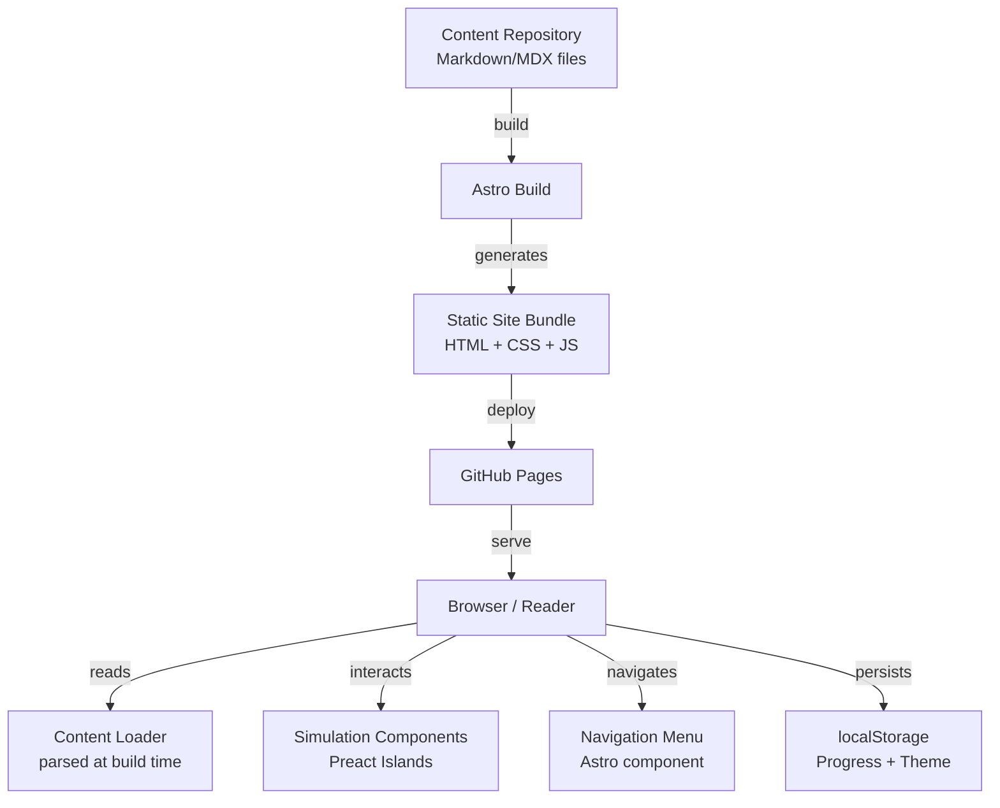
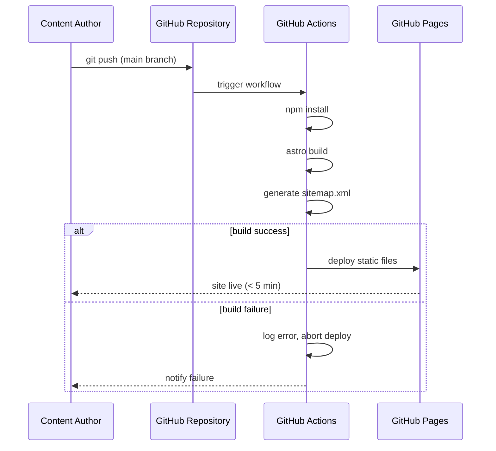

# Design Document: Interactive Banking Book

## Overview

O Interactive Banking Book é um site estático hospedado no GitHub Pages que apresenta um livro digital interativo sobre o funcionamento de bancos comerciais. A aplicação é construída como um Single Page Application (SPA) leve, sem backend, onde todo o conteúdo é carregado a partir de arquivos Markdown incluídos no bundle de build.

A arquitetura prioriza:
- **Zero backend**: todo processamento ocorre no cliente
- **Conteúdo como código**: Markdown versionado no mesmo repositório
- **Performance**: bundle otimizado, carregamento rápido em 4G
- **Acessibilidade**: WCAG 2.1 AA/AAA, navegação por teclado e leitores de tela
- **Extensibilidade**: novos capítulos adicionados via commit, sem alterar código

### Stack Tecnológica

| Camada | Tecnologia | Justificativa |
|---|---|---|
| Framework | **Astro** | Geração estática nativa, suporte a Markdown/MDX, zero JS por padrão |
| Componentes UI | **Preact** (via Astro islands) | Leve (~3KB), compatível com Astro islands para simulações interativas |
| Estilização | **CSS custom properties + PostCSS** | Temas claro/escuro via variáveis, sem runtime overhead |
| Diagramas | **Mermaid.js** | Renderização de diagramas a partir de Markdown, amplamente suportado |
| Animações | **CSS animations + Intersection Observer API** | Sem dependência extra, respeita `prefers-reduced-motion` |
| Conteúdo | **MDX** (Markdown + JSX) | Permite embutir componentes de Simulation e Diagram no conteúdo |
| Build/Deploy | **GitHub Actions + GitHub Pages** | Deploy automático a cada push |
| Testes | **Vitest + fast-check** | Testes unitários e property-based testing |

---

## Architecture

### Visão Geral



### Fluxo de Build e Deploy



### Estrutura de Diretórios

```
/
├── .github/
│   └── workflows/
│       └── deploy.yml          # CI/CD pipeline
├── src/
│   ├── components/
│   │   ├── NavigationMenu.astro
│   │   ├── GlossaryPanel.astro
│   │   ├── ThemeToggle.astro
│   │   ├── ProgressTracker.astro
│   │   ├── SkipLink.astro
│   │   └── simulations/
│   │       └── MoneyCreation.tsx  # Preact island
│   ├── layouts/
│   │   ├── BaseLayout.astro
│   │   └── ChapterLayout.astro
│   ├── pages/
│   │   ├── index.astro            # Landing page
│   │   └── [...slug].astro        # Dynamic chapter/section routes
│   └── styles/
│       ├── global.css
│       └── themes.css             # CSS custom properties
├── content/
│   ├── chapters/
│   │   ├── 01-introducao/
│   │   │   ├── index.md           # Chapter metadata
│   │   │   └── 01-o-que-e-banco.mdx
│   │   └── 02-criacao-de-dinheiro/
│   │       ├── index.md
│   │       └── 01-multiplicador-monetario.mdx
│   └── glossary/
│       └── terms.md               # Glossary terms
├── public/
│   └── og-image.png
└── astro.config.mjs
```

---

## Components and Interfaces

### NavigationMenu

Componente Astro que renderiza a hierarquia de capítulos e seções. Em desktop, exibido como painel lateral fixo. Em mobile, recolhível via botão hambúrguer.

```typescript
interface NavItem {
  title: string;
  slug: string;
  url: string;          // /capitulo-1/criacao-de-dinheiro
  children?: NavItem[]; // sections dentro de um chapter
}

interface NavigationMenuProps {
  items: NavItem[];
  currentUrl: string;
}
```

**Comportamento:**
- Destaca o item ativo via `aria-current="page"`
- Exibe indicador visual (ícone de check) em seções visitadas (lido do localStorage)
- Scroll suave via `scroll-behavior: smooth` + `scrollIntoView`
- `role="navigation"` com `aria-label="Navegação do livro"`

### GlossaryPanel

Painel lateral/modal com definições de termos. Abre sem navegação de página.

```typescript
interface GlossaryTerm {
  id: string;
  term: string;
  definition: string;
  relatedTerms?: string[];
}

interface GlossaryPanelProps {
  terms: GlossaryTerm[];
  initialTerm?: string;
}
```

**Comportamento:**
- `role="complementary"` + `aria-label="Glossário"`
- Foco retorna ao termo clicado ao fechar (via `returnFocusRef`)
- Pesquisa em tempo real filtrando `term` e `definition`
- Termos no texto marcados com `<abbr>` ou `<span data-glossary-term>`

### ProgressTracker

Módulo TypeScript puro (sem UI própria) que gerencia o estado de progresso no localStorage.

```typescript
interface ReadingProgress {
  visitedSections: string[];   // array de slugs visitados
  lastVisited: string | null;  // slug da última seção visitada
  totalSections: number;
}

interface ProgressTracker {
  markVisited(slug: string): void;
  getProgress(): ReadingProgress;
  getPercentage(): number;       // 0-100
  reset(): void;
  restore(): string | null;      // retorna lastVisited
}
```

**Chave localStorage:** `ibbook_progress`

### ThemeManager

Módulo que gerencia o tema claro/escuro.

```typescript
type Theme = 'light' | 'dark' | 'system';

interface ThemeManager {
  getTheme(): Theme;
  setTheme(theme: Theme): void;
  getResolvedTheme(): 'light' | 'dark'; // resolve 'system' via prefers-color-scheme
}
```

**Chave localStorage:** `ibbook_theme`

**Implementação:** Script inline no `<head>` para evitar FOUC (Flash of Unstyled Content).

### Simulation: MoneyCreation (Preact Island)

Componente interativo para demonstrar criação de dinheiro via reserva fracionária.

```typescript
interface MoneyCreationProps {
  defaultDeposit?: number;       // default: 1000
  defaultReserveRatio?: number;  // default: 0.10 (10%)
}

interface MoneyCreationState {
  deposit: number;
  reserveRatio: number;          // 0.01 a 1.0
  error: string | null;
}

// Cálculos derivados (sem estado):
// moneyMultiplier = 1 / reserveRatio
// totalMoneyCreated = deposit * moneyMultiplier
```

**Validação de inputs:**
- `deposit`: número positivo, máximo 1.000.000.000
- `reserveRatio`: entre 0.01 (1%) e 1.0 (100%)

### ContentLoader

Processado em build time pelo Astro. Lê os arquivos MDX do diretório `content/`, extrai frontmatter e gera as rotas estáticas.

```typescript
interface SectionFrontmatter {
  title: string;
  order: number;
  description?: string;
  simulation?: string;   // nome do componente de simulação
  diagram?: string;      // tipo de diagrama
  ogImage?: string;
}

interface ChapterMeta {
  title: string;
  order: number;
  description: string;
  slug: string;
}
```

### DiagramRenderer

Wrapper Astro que renderiza diagramas Mermaid. Usa Intersection Observer para iniciar animações ao entrar no viewport.

```typescript
interface DiagramProps {
  type: 'mermaid' | 'flow';
  content: string;
  alt: string;           // texto alternativo obrigatório
  animated?: boolean;
}
```

---

## Data Models

### Estrutura de Conteúdo (Frontmatter YAML)

**Arquivo de Seção (`section.mdx`):**
```yaml
---
title: "Criação de Dinheiro via Empréstimos"
order: 1
description: "Como bancos comerciais criam dinheiro através do sistema de reserva fracionária"
simulation: "MoneyCreation"
diagram: "money-flow"
ogImage: "/og/criacao-de-dinheiro.png"
---
```

**Arquivo de Capítulo (`index.md`):**
```yaml
---
title: "Criação de Dinheiro"
order: 2
description: "Entenda como o dinheiro é criado no sistema bancário moderno"
---
```

### Glossário (`content/glossary/terms.md`)

```markdown
---
terms:
  - id: reserva-fracionaria
    term: "Reserva Fracionária"
    definition: "Sistema pelo qual bancos mantêm apenas uma fração dos depósitos como reserva..."
    relatedTerms: [multiplicador-monetario]
  - id: multiplicador-monetario
    term: "Multiplicador Monetário"
    definition: "Fator pelo qual a base monetária é expandida pelo sistema bancário..."
---
```

### Estado de Progresso (localStorage)

```json
{
  "ibbook_progress": {
    "visitedSections": [
      "introducao/o-que-e-banco",
      "criacao-de-dinheiro/multiplicador-monetario"
    ],
    "lastVisited": "criacao-de-dinheiro/multiplicador-monetario",
    "totalSections": 12
  }
}
```

### Estado de Tema (localStorage)

```json
{
  "ibbook_theme": "dark"
}
```

### Variáveis CSS de Tema

```css
:root {
  /* Paleta primária (5 cores) */
  --color-primary: #2563eb;
  --color-secondary: #7c3aed;
  --color-accent: #0891b2;
  --color-surface: #f8f7f4;   /* off-white, luminosidade ~97% */
  --color-text: #1a1a2e;

  /* Tipografia */
  --font-display: 'Playfair Display', Georgia, serif;
  --font-body: 'Inter', system-ui, sans-serif;
  --font-size-base: 1rem;       /* 16px */
  --line-height-body: 1.6;
  --measure: 65ch;              /* max ~75 chars */

  /* Espaçamento */
  --spacing-content: 24px;
  --spacing-block: 3rem;
  --spacing-paragraph: 1.2em;
}

[data-theme="dark"] {
  --color-surface: #0f172a;
  --color-text: #e2e8f0;
  /* ... demais overrides */
}
```

### Sitemap (gerado em build)

```xml
<?xml version="1.0" encoding="UTF-8"?>
<urlset xmlns="http://www.sitemaps.org/schemas/sitemap/0.9">
  <url>
    <loc>https://user.github.io/interactive-banking-book/</loc>
    <changefreq>weekly</changefreq>
  </url>
  <url>
    <loc>https://user.github.io/interactive-banking-book/capitulo-1/o-que-e-banco</loc>
    <changefreq>monthly</changefreq>
  </url>
</urlset>
```

---

## Correctness Properties

*A property is a characteristic or behavior that should hold true across all valid executions of a system — essentially, a formal statement about what the system should do. Properties serve as the bridge between human-readable specifications and machine-verifiable correctness guarantees.*


### Property 1: Ordem hierárquica da navegação

*For any* conjunto de capítulos e seções com campos `order` definidos, o NavigationMenu renderizado deve exibir os itens na mesma ordem crescente dos valores de `order`, preservando a hierarquia chapter → section.

**Validates: Requirements 1.1**

---

### Property 2: Unicidade de URLs por Seção

*For any* conjunto de seções do livro, cada seção deve ter uma URL única no formato `/chapter-slug/section-slug`, e nenhum par de seções distintas deve compartilhar a mesma URL.

**Validates: Requirements 1.6, 11.4**

---

### Property 3: Item ativo no Navigation_Menu

*For any* URL de seção atual, o item do Navigation_Menu correspondente àquela URL deve ter o atributo `aria-current="page"` e nenhum outro item deve ter esse atributo simultaneamente.

**Validates: Requirements 1.3**

---

### Property 4: Round-trip de progresso de leitura

*For any* sequência de slugs de seções visitadas, após chamar `markVisited` para cada slug e depois `getProgress()`, o array `visitedSections` deve conter todos os slugs visitados e `lastVisited` deve ser igual ao último slug da sequência.

**Validates: Requirements 2.1, 2.2**

---

### Property 5: Cálculo correto do percentual de progresso

*For any* estado de progresso com `N` seções visitadas e `T` seções totais (T > 0), `getPercentage()` deve retornar exatamente `(N / T) * 100`, arredondado para no máximo uma casa decimal, e o valor deve estar sempre no intervalo [0, 100].

**Validates: Requirements 2.4**

---

### Property 6: Reset zera completamente o progresso

*For any* estado de progresso não-vazio, após chamar `reset()`, `getProgress()` deve retornar `visitedSections = []`, `lastVisited = null`, e `getPercentage()` deve retornar `0`.

**Validates: Requirements 2.5**

---

### Property 7: Fórmula do multiplicador monetário

*For any* valor de depósito inicial `D > 0` e taxa de reserva fracionária `R` no intervalo `[0.01, 1.0]`, a simulação deve calcular `moneyMultiplier = 1 / R` e `totalMoneyCreated = D * moneyMultiplier`, com precisão de ponto flutuante padrão IEEE 754.

**Validates: Requirements 3.3**

---

### Property 8: Rejeição de inputs inválidos na Simulation

*For any* valor de depósito `D ≤ 0` ou `D > 1.000.000.000`, ou taxa de reserva `R < 0.01` ou `R > 1.0`, a simulação deve retornar um estado de erro não-nulo e não deve computar nem exibir resultados numéricos.

**Validates: Requirements 3.5**

---

### Property 9: Reset da Simulation restaura valores padrão

*For any* estado modificado da simulação, após chamar a ação de reset, todos os parâmetros devem ser iguais aos valores padrão definidos nas props (`defaultDeposit`, `defaultReserveRatio`) e o campo `error` deve ser `null`.

**Validates: Requirements 3.4**

---

### Property 10: Filtro do Glossário retorna apenas termos relevantes

*For any* query de pesquisa não-vazia `Q` e lista de termos do glossário, a função de filtro deve retornar apenas os termos onde `term` ou `definition` contém `Q` (case-insensitive), e nenhum termo que não satisfaça essa condição deve aparecer nos resultados.

**Validates: Requirements 4.4**

---

### Property 11: Lookup de definição de termo

*For any* termo destacado no texto que existe no glossário, a função de lookup deve retornar a definição correspondente; para qualquer termo que não existe no glossário, deve retornar `null` ou `undefined`.

**Validates: Requirements 4.2**

---

### Property 12: Round-trip de parsing de frontmatter

*For any* arquivo MDX com frontmatter YAML válido contendo os campos `title`, `order`, e opcionalmente `description`, `simulation`, `diagram`, o parser deve extrair todos os campos presentes sem perda de dados, e o título e ordem extraídos devem ser idênticos aos valores no arquivo fonte.

**Validates: Requirements 8.3, 8.5**

---

### Property 13: Conteúdo ausente não interrompe renderização

*For any* conjunto de seções onde uma ou mais referências de conteúdo estão ausentes do bundle, o renderer deve exibir uma mensagem de erro descritiva para as seções ausentes e renderizar normalmente todas as demais seções presentes.

**Validates: Requirements 8.4**

---

### Property 14: Navigation_Menu inclui todos os arquivos de conteúdo

*For any* conjunto de arquivos Markdown/MDX válidos no diretório de conteúdo, o Navigation_Menu gerado em build time deve conter exatamente um item para cada arquivo, sem omissões nem duplicatas.

**Validates: Requirements 8.2**

---

### Property 15: Round-trip de persistência de tema

*For any* valor de tema `T ∈ {light, dark}`, após chamar `setTheme(T)`, tanto `getResolvedTheme()` deve retornar `T` quanto o valor armazenado em `localStorage['ibbook_theme']` deve ser igual a `T`.

**Validates: Requirements 6.2, 6.3**

---

### Property 16: Metadados de página completos e únicos

*For any* seção do livro, o HTML gerado deve conter: um elemento `<title>` único com o título da seção, uma `<meta name="description">` com o resumo da seção, e as tags Open Graph `og:title`, `og:description`, `og:url`, `og:image` — e nenhum par de seções distintas deve ter o mesmo `<title>` ou `og:url`.

**Validates: Requirements 11.1, 11.2**

---

### Property 17: Sitemap lista todas as URLs públicas

*For any* conjunto de seções geradas no build, o arquivo `sitemap.xml` deve conter exatamente uma entrada `<url>` para cada seção pública, com `<loc>` seguindo o padrão `/chapter-slug/section-slug`, sem omissões nem duplicatas.

**Validates: Requirements 11.3**

---

### Property 18: ARIA landmarks presentes em toda página renderizada

*For any* página renderizada do livro, o HTML deve conter exatamente um elemento com `role="navigation"` (ou `<nav>`), um com `role="main"` (ou `<main>`), e quando o Glossary_Panel estiver visível, um com `role="complementary"`.

**Validates: Requirements 12.2**

---

### Property 19: Região aria-live atualizada ao navegar entre seções

*For any* navegação para uma nova seção, o conteúdo do elemento com `aria-live="polite"` deve ser atualizado para conter o título da nova seção, permitindo que leitores de tela anunciem a mudança.

**Validates: Requirements 12.4**

---

### Property 20: Landing page reflete estado de progresso

*For any* estado de progresso salvo com `lastVisited` não-nulo, a landing page deve exibir um call-to-action "Continuar leitura" com link para a última seção visitada; para qualquer estado sem progresso salvo, deve exibir "Começar a leitura" apontando para a primeira seção do primeiro capítulo.

**Validates: Requirements 13.3**

---

### Property 21: Landing page lista todos os capítulos disponíveis

*For any* conjunto de capítulos no Content_Repository, a landing page deve exibir exatamente um item para cada capítulo, com título e descrição, sem omissões.

**Validates: Requirements 13.2**

---

### Property 22: Diagrams possuem texto alternativo

*For any* diagrama renderizado no livro, o elemento HTML correspondente deve conter um atributo `alt` não-vazio ou `aria-label` não-vazio descrevendo o conteúdo visual.

**Validates: Requirements 5.6**

---

## Error Handling

### Conteúdo Ausente

Quando o `ContentLoader` não encontra um arquivo referenciado no frontmatter ou na estrutura de diretórios:

```typescript
// Renderiza um componente de erro inline, sem lançar exceção
<ContentError
  message={`Seção não encontrada: ${slug}`}
  suggestion="Verifique se o arquivo existe no repositório de conteúdo."
/>
```

O build **não falha** por conteúdo ausente — apenas exibe o erro inline. O CI/CD pipeline falha apenas por erros de compilação TypeScript/Astro.

### Inputs Inválidos nas Simulações

```typescript
function validateMoneyCreationInputs(deposit: number, reserveRatio: number): string | null {
  if (deposit <= 0 || deposit > 1_000_000_000) {
    return `Depósito deve ser entre R$ 0,01 e R$ 1.000.000.000`;
  }
  if (reserveRatio < 0.01 || reserveRatio > 1.0) {
    return `Taxa de reserva deve ser entre 1% e 100%`;
  }
  return null;
}
```

Erros são exibidos inline abaixo do campo inválido, com `role="alert"` para leitores de tela.

### localStorage Indisponível

O `ProgressTracker` e o `ThemeManager` devem funcionar em modo degradado quando o localStorage não está disponível (ex: modo privado em alguns browsers):

```typescript
function safeLocalStorageGet(key: string): string | null {
  try {
    return localStorage.getItem(key);
  } catch {
    return null; // fallback silencioso
  }
}
```

### Falha no Build (CI/CD)

Se o `astro build` retornar código de saída não-zero, o workflow do GitHub Actions deve:
1. Registrar o erro no log de execução
2. Não executar o step de deploy
3. Manter a versão anterior publicada no GitHub Pages intacta

### Frontmatter Inválido

Se um arquivo MDX tiver frontmatter malformado ou campos obrigatórios ausentes (`title`, `order`), o build deve falhar com uma mensagem de erro clara indicando o arquivo problemático, evitando publicar conteúdo com metadados incorretos.

---

## Testing Strategy

### Abordagem Dual: Testes Unitários + Property-Based Testing

Os testes são organizados em duas camadas complementares:

- **Testes unitários**: verificam exemplos específicos, casos de borda e condições de erro
- **Testes de propriedade**: verificam propriedades universais através de inputs gerados aleatoriamente

Ambas as camadas são necessárias: testes unitários capturam bugs concretos em casos específicos, enquanto testes de propriedade verificam a corretude geral do sistema.

### Ferramentas

| Ferramenta | Uso |
|---|---|
| **Vitest** | Test runner, testes unitários e de integração |
| **fast-check** | Property-based testing (PBT) para TypeScript |
| **@testing-library/preact** | Testes de componentes Preact |
| **happy-dom** | DOM environment para Vitest |

### Configuração de Property-Based Testing

Cada teste de propriedade deve:
- Executar no mínimo **100 iterações** (configurado via `fc.configureGlobal({ numRuns: 100 })`)
- Referenciar a propriedade do design document via comentário de tag
- Ser implementado por um único teste de propriedade por propriedade definida

**Formato de tag:**
```typescript
// Feature: interactive-banking-book, Property N: <texto da propriedade>
```

### Testes Unitários

Focados em:
- Exemplos específicos de cálculos da simulação (valores conhecidos)
- Casos de borda: `reserveRatio = 1.0` (sem multiplicação), `deposit = 0.01` (mínimo)
- Integração entre `ProgressTracker` e localStorage
- Renderização de componentes com props específicas
- Comportamento do skip link e ARIA landmarks

```typescript
// Exemplo: teste unitário para cálculo da simulação
describe('MoneyCreation calculation', () => {
  it('calculates correctly for 10% reserve ratio', () => {
    expect(calculateMoneyCreation(1000, 0.10)).toEqual({
      moneyMultiplier: 10,
      totalMoneyCreated: 10000,
      error: null,
    });
  });
});
```

### Testes de Propriedade

Cada propriedade do design document deve ser implementada como um teste de propriedade com fast-check:

```typescript
import fc from 'fast-check';

// Feature: interactive-banking-book, Property 7: Fórmula do multiplicador monetário
test('money creation formula holds for all valid inputs', () => {
  fc.assert(
    fc.property(
      fc.float({ min: 0.01, max: 1_000_000_000, noNaN: true }),
      fc.float({ min: 0.01, max: 1.0, noNaN: true }),
      (deposit, reserveRatio) => {
        const result = calculateMoneyCreation(deposit, reserveRatio);
        expect(result.error).toBeNull();
        expect(result.moneyMultiplier).toBeCloseTo(1 / reserveRatio, 5);
        expect(result.totalMoneyCreated).toBeCloseTo(deposit / reserveRatio, 5);
      }
    ),
    { numRuns: 100 }
  );
});

// Feature: interactive-banking-book, Property 8: Rejeição de inputs inválidos
test('simulation rejects out-of-range inputs', () => {
  fc.assert(
    fc.property(
      fc.oneof(
        fc.float({ max: 0 }),
        fc.float({ min: 1_000_000_001 })
      ),
      fc.float({ min: 0.01, max: 1.0, noNaN: true }),
      (invalidDeposit, reserveRatio) => {
        const result = calculateMoneyCreation(invalidDeposit, reserveRatio);
        expect(result.error).not.toBeNull();
      }
    ),
    { numRuns: 100 }
  );
});

// Feature: interactive-banking-book, Property 5: Cálculo correto do percentual de progresso
test('progress percentage is always in [0, 100]', () => {
  fc.assert(
    fc.property(
      fc.array(fc.string({ minLength: 1 })),
      fc.integer({ min: 1, max: 100 }),
      (visited, total) => {
        const tracker = createProgressTracker(total);
        visited.slice(0, total).forEach(slug => tracker.markVisited(slug));
        const pct = tracker.getPercentage();
        expect(pct).toBeGreaterThanOrEqual(0);
        expect(pct).toBeLessThanOrEqual(100);
      }
    ),
    { numRuns: 100 }
  );
});

// Feature: interactive-banking-book, Property 10: Filtro do Glossário
test('glossary filter returns only matching terms', () => {
  fc.assert(
    fc.property(
      fc.array(fc.record({ id: fc.string(), term: fc.string(), definition: fc.string() })),
      fc.string({ minLength: 1 }),
      (terms, query) => {
        const results = filterGlossaryTerms(terms, query);
        const lowerQuery = query.toLowerCase();
        results.forEach(result => {
          const matches =
            result.term.toLowerCase().includes(lowerQuery) ||
            result.definition.toLowerCase().includes(lowerQuery);
          expect(matches).toBe(true);
        });
      }
    ),
    { numRuns: 100 }
  );
});

// Feature: interactive-banking-book, Property 2: Unicidade de URLs por Seção
test('all section URLs are unique', () => {
  fc.assert(
    fc.property(
      fc.array(
        fc.record({ chapterSlug: fc.string({ minLength: 1 }), sectionSlug: fc.string({ minLength: 1 }) }),
        { minLength: 1 }
      ),
      (sections) => {
        const urls = sections.map(s => `/${s.chapterSlug}/${s.sectionSlug}`);
        const uniqueUrls = new Set(urls);
        // URLs are unique if and only if the slug pairs are unique
        expect(uniqueUrls.size).toBe(new Set(sections.map(s => `${s.chapterSlug}/${s.sectionSlug}`)).size);
      }
    ),
    { numRuns: 100 }
  );
});
```

### Cobertura Esperada

| Módulo | Tipo de Teste | Propriedades Cobertas |
|---|---|---|
| `calculateMoneyCreation` | Property | 7, 8, 9 |
| `ProgressTracker` | Property + Unit | 4, 5, 6 |
| `ThemeManager` | Property + Unit | 15 |
| `filterGlossaryTerms` | Property | 10 |
| `lookupGlossaryTerm` | Property | 11 |
| `parseFrontmatter` | Property | 12 |
| `generateNavItems` | Property | 1, 14 |
| `generateSectionUrl` | Property | 2 |
| `renderPage` (HTML) | Unit | 16, 17, 18, 19, 22 |
| `LandingPage` component | Property + Unit | 20, 21 |
| `ContentRenderer` | Unit | 13 |
