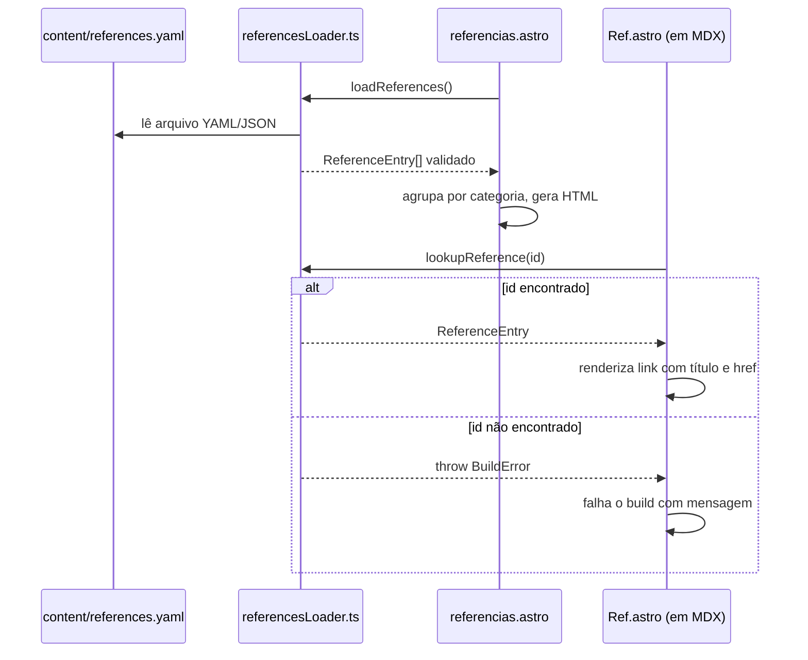

# Design Document: Seção de Referências

## Overview

A funcionalidade de Seção de Referências adiciona ao livro interativo um sistema de referências regulatórias composto por três partes:

1. **Reference_Registry** — arquivo de dados centralizado (YAML/JSON) em `content/` que armazena todas as normas e leis cadastradas
2. **References_Page** — página estática gerada em build time em `/referencias`, listando todas as referências agrupadas por categoria
3. **Componente `<Ref />`** — componente MDX que, dado um `id`, renderiza automaticamente um link inline para a âncora correspondente na References_Page

A arquitetura segue o padrão já estabelecido no projeto: dados como código versionado, geração estática em build time, zero backend, e utilitários TypeScript puros separados dos componentes Astro.

---

## Architecture

```mermaid
graph TD
    A[content/references.yaml<br/>Reference_Registry] -->|lido em build time| B[src/utils/referencesLoader.ts]
    B -->|valida e exporta| C[ReferenceEntry[]]
    C -->|alimenta| D[src/pages/referencias.astro<br/>References_Page]
    C -->|alimenta| E[src/components/Ref.astro<br/>Inline_Reference_Link]
    D -->|renderiza| F[HTML estático /referencias]
    E -->|embutido em MDX| G[Seções do livro]
    F -->|âncoras #ref-id| G
```

### Fluxo de Build



---

## Components and Interfaces

### `src/utils/referencesLoader.ts`

Utilitário TypeScript puro (sem dependências de framework) responsável por:
- Definir os tipos de dados
- Validar entradas do registry
- Detectar IDs duplicados
- Expor funções de lookup

```typescript
export type ReferenceCategory =
  | 'CMN'
  | 'BACEN'
  | 'Lei Federal'
  | 'Medida Provisória'
  | string; // extensível para categorias futuras

export interface ReferenceEntry {
  id: string;           // identificador único, ex: "resolucao-cmn-4966"
  title: string;        // título da norma
  issuer: string;       // órgão emissor, ex: "Banco Central do Brasil"
  category: ReferenceCategory;
  url: string;          // URL do documento oficial
  description?: string; // texto explicativo opcional
  publishedAt?: string; // data ISO 8601 opcional, ex: "2021-11-25"
}

/**
 * Valida e retorna um array de ReferenceEntry a partir de dados brutos.
 * Lança erro se campos obrigatórios estiverem ausentes ou se houver IDs duplicados.
 */
export function parseReferences(raw: unknown[]): ReferenceEntry[];

/**
 * Retorna a ReferenceEntry com o id fornecido, ou null se não encontrada.
 */
export function lookupReference(entries: ReferenceEntry[], id: string): ReferenceEntry | null;

/**
 * Agrupa um array de ReferenceEntry por categoria.
 * Retorna um Map<category, ReferenceEntry[]> com entradas ordenadas por título.
 */
export function groupByCategory(entries: ReferenceEntry[]): Map<string, ReferenceEntry[]>;

/**
 * Gera o href de âncora para uma referência: "#ref-{id}"
 */
export function referenceAnchor(id: string): string;

/**
 * Gera o href completo para um Inline_Reference_Link: "/referencias#ref-{id}"
 * Considera o BASE_URL do Astro.
 */
export function referenceHref(id: string, baseUrl?: string): string;
```

### `src/pages/referencias.astro`

Página estática que:
- Importa `referencesLoader` e carrega `content/references.yaml` via `fs` em build time
- Agrupa referências por categoria
- Renderiza seções semânticas com âncoras

```
Props: nenhuma (página estática)
Route: /referencias
```

### `src/components/Ref.astro`

Componente Astro para uso em arquivos MDX:

```astro
---
// Props
interface Props {
  id: string;
}
---
```

Renderiza: `<a href="/referencias#ref-{id}" class="ref-link" aria-label="Ver referência: {title}">{title}</a>`

Falha o build se `id` não existir no registry.

### `content/references.yaml`

Arquivo de dados centralizado. Exemplo de estrutura:

```yaml
- id: resolucao-cmn-4966
  title: "Resolução CMN nº 4.966/2021"
  issuer: "Conselho Monetário Nacional"
  category: CMN
  url: "https://www.bcb.gov.br/estabilidadefinanceira/exibenormativo?tipo=Resolução CMN&numero=4966"
  description: "Dispõe sobre instrumentos financeiros, sobre redução ao valor recuperável de ativos e sobre apresentação e divulgação de informações de instrumentos financeiros."
  publishedAt: "2021-11-25"

- id: circular-bacen-3978
  title: "Circular BACEN nº 3.978/2020"
  issuer: "Banco Central do Brasil"
  category: BACEN
  url: "https://www.bcb.gov.br/estabilidadefinanceira/exibenormativo?tipo=Circular&numero=3978"
  description: "Dispõe sobre a política de prevenção à lavagem de dinheiro e ao financiamento do terrorismo."
  publishedAt: "2020-01-23"
```

---

## Data Models

### `ReferenceEntry`

| Campo | Tipo | Obrigatório | Descrição |
|---|---|---|---|
| `id` | `string` | sim | Identificador único kebab-case |
| `title` | `string` | sim | Título completo da norma |
| `issuer` | `string` | sim | Órgão emissor |
| `category` | `ReferenceCategory` | sim | Categoria para agrupamento |
| `url` | `string` | sim | URL do documento oficial |
| `description` | `string` | não | Texto explicativo |
| `publishedAt` | `string` | não | Data ISO 8601 (YYYY-MM-DD) |

### Invariantes de Validação

- `id` deve ser único em todo o registry — build falha com mensagem indicando o ID conflitante
- `id` referenciado em `<Ref id="..." />` deve existir no registry — build falha com mensagem indicando o ID e o arquivo MDX
- `publishedAt`, quando presente, deve seguir o formato `YYYY-MM-DD`
- `url` deve ser uma string não-vazia (validação de formato básica)

### Integração com NavigationMenu

A References_Page é adicionada ao `navItems` como item de nível superior (sem filhos), após os capítulos do livro. O item é injetado em `src/pages/referencias.astro` e passado ao `BaseLayout` via prop `navItems`.

Para evitar duplicação, o item de navegação para `/referencias` é construído diretamente na página `referencias.astro` e concatenado ao array de `navItems` gerado pelo `contentLoader`.

---

## Correctness Properties

*A property is a characteristic or behavior that should hold true across all valid executions of a system — essentially, a formal statement about what the system should do. Properties serve as the bridge between human-readable specifications and machine-verifiable correctness guarantees.*

### Property 1: Parsing de referências válidas preserva todos os campos

*For any* array de objetos com os campos obrigatórios (`id`, `title`, `issuer`, `category`, `url`) e campos opcionais válidos, `parseReferences` deve retornar um array de `ReferenceEntry` com os mesmos valores, sem perda de dados.

**Validates: Requirements 1.1, 1.2, 1.3**

### Property 2: IDs duplicados causam erro de build

*For any* array de referências que contenha dois ou mais objetos com o mesmo `id`, `parseReferences` deve lançar um erro cuja mensagem inclui o `id` conflitante.

**Validates: Requirements 1.4**

### Property 3: Agrupamento por categoria é completo e particionado

*For any* array de `ReferenceEntry`, `groupByCategory` deve retornar grupos tais que: (a) toda referência aparece em exatamente um grupo, (b) o grupo corresponde à `category` da referência, e (c) a união de todos os grupos é igual ao conjunto original.

**Validates: Requirements 2.2**

### Property 4: Âncoras são únicas e seguem o formato correto

*For any* array de `ReferenceEntry` com IDs distintos, `referenceAnchor(id)` deve retornar `"#ref-{id}"` e o conjunto de âncoras geradas deve ter cardinalidade igual ao número de referências (sem colisões).

**Validates: Requirements 2.4**

### Property 5: Renderização de entrada de referência contém campos obrigatórios

*For any* `ReferenceEntry`, a string HTML renderizada para aquela entrada deve conter o `title`, o `issuer`, e um elemento `<a>` com `href` apontando para `url` e atributo `target="_blank"`. Quando `description` está presente, deve também aparecer no HTML.

**Validates: Requirements 2.3, 2.5**

### Property 6: Lookup de ID válido retorna a referência correta

*For any* array de `ReferenceEntry` e qualquer `id` presente nesse array, `lookupReference(entries, id)` deve retornar a entrada cujo `id` é igual ao argumento.

**Validates: Requirements 3.1, 3.4**

### Property 7: Lookup de ID inválido retorna null

*For any* array de `ReferenceEntry` e qualquer string `id` que não esteja presente no array, `lookupReference(entries, id)` deve retornar `null`.

**Validates: Requirements 3.3**

### Property 8: href do Inline_Reference_Link aponta para a âncora correta

*For any* `ReferenceEntry`, `referenceHref(entry.id, baseUrl)` deve retornar uma string que termina com `"/referencias#ref-{entry.id}"`.

**Validates: Requirements 3.2**

### Property 9: aria-label do Inline_Reference_Link segue o formato correto

*For any* `ReferenceEntry`, o `aria-label` gerado para o link inline deve ser igual a `"Ver referência: {entry.title}"`.

**Validates: Requirements 4.1**

### Property 10: aria-label dos links externos segue o formato correto

*For any* `ReferenceEntry`, o `aria-label` gerado para o link externo na References_Page deve ser igual a `"{entry.title} (abre em nova aba)"`.

**Validates: Requirements 4.3**

### Property 11: Atualização de URL no registry é refletida no loader

*For any* `ReferenceEntry` com `url` atualizada, `parseReferences` seguido de `lookupReference` deve retornar a entrada com a nova URL.

**Validates: Requirements 5.3**

---

## Error Handling

### Erros de Build (falham o processo de build)

| Situação | Mensagem de Erro |
|---|---|
| ID duplicado no registry | `[references] ID duplicado encontrado: "{id}". Cada referência deve ter um identificador único.` |
| ID não encontrado em `<Ref />` | `[references] ID de referência não encontrado: "{id}" em {arquivo.mdx}. Verifique o Reference_Registry.` |
| Campo obrigatório ausente | `[references] Referência inválida: campo obrigatório "{campo}" ausente na entrada com id "{id}".` |
| `publishedAt` com formato inválido | `[references] Data inválida em "{id}": "{valor}" não segue o formato ISO 8601 (YYYY-MM-DD).` |

### Degradação Graceful (não falham o build)

- `description` ausente: a seção de descrição simplesmente não é renderizada
- `publishedAt` ausente: a data não é exibida na References_Page

---

## Testing Strategy

### Abordagem Dual

A estratégia combina testes unitários (exemplos concretos e casos de borda) com testes baseados em propriedades (cobertura ampla via geração aleatória de entradas).

**Testes unitários** (`src/tests/references.test.ts`):
- Exemplo: `parseReferences` com um array válido retorna as entradas corretas
- Exemplo: `parseReferences` com ID duplicado lança erro com a mensagem correta
- Exemplo: `lookupReference` com ID existente retorna a entrada
- Exemplo: `lookupReference` com ID inexistente retorna `null`
- Exemplo: `groupByCategory` com referências de 3 categorias retorna 3 grupos
- Exemplo: `referenceAnchor("resolucao-cmn-4966")` retorna `"#ref-resolucao-cmn-4966"`
- Caso de borda: `parseReferences` com array vazio retorna `[]`
- Caso de borda: referência sem `description` é aceita sem erro
- Caso de borda: referência sem `publishedAt` é aceita sem erro
- Caso de borda: `publishedAt` com formato inválido lança erro

**Testes baseados em propriedades** (`src/tests/references.test.ts`, usando `fast-check`):

Cada teste de propriedade deve rodar no mínimo 100 iterações e referenciar a propriedade do design com o formato:
`// Feature: references-section, Property {N}: {texto da propriedade}`

| Teste | Propriedade | Biblioteca |
|---|---|---|
| `parseReferences` preserva todos os campos | Property 1 | fast-check |
| IDs duplicados causam erro | Property 2 | fast-check |
| `groupByCategory` é completo e particionado | Property 3 | fast-check |
| Âncoras são únicas e no formato correto | Property 4 | fast-check |
| `lookupReference` retorna entrada correta | Property 6 | fast-check |
| `lookupReference` retorna null para ID ausente | Property 7 | fast-check |
| `referenceHref` aponta para âncora correta | Property 8 | fast-check |
| `aria-label` inline segue formato | Property 9 | fast-check |
| `aria-label` externo segue formato | Property 10 | fast-check |
| Atualização de URL é refletida | Property 11 | fast-check |

**Testes de componente** (estruturais, via leitura de source):
- `referencias.astro` usa elementos `<section>` e `<article>` (Property 4.2 / Req 4.2)
- `Ref.astro` contém `aria-label` com o padrão correto
- `referencias.astro` contém `target="_blank"` nos links externos

**Testes de exemplo de página**:
- A rota `/referencias` existe no build (Req 2.1)
- O item de navegação para `/referencias` está presente no `navItems` (Req 2.6)
- As categorias mínimas (CMN, BACEN, Lei Federal, Medida Provisória) são suportadas (Req 5.4)
